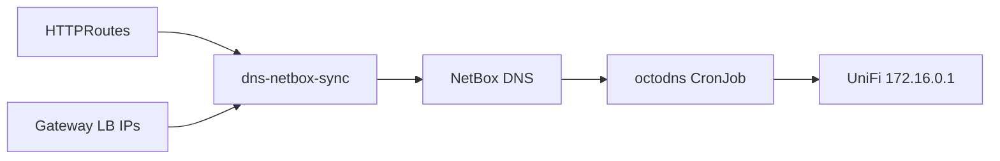

# DNS — NetBox source of truth

NetBox DNS (`netbox-plugin-dns`) is the authoritative store for `lab.mxe11.nl`.
Cluster hostnames flow **HTTPRoute → NetBox → UniFi**; nothing writes UniFi directly
except OctoDNS.

## Architecture



| Component | Namespace | Purpose |
|-----------|-----------|---------|
| `dns-netbox-sync` | `dns` | Watches HTTPRoutes, upserts A records in NetBox |
| `octodns-sync` | `dns` | Every 5 min: NetBox → UniFi local DNS |
| NetBox + plugin | `netbox` | UI/API for zones and records |

Argo CD app: [`dns-app.yaml`](dns-app.yaml) → [`platform/dns/`](dns/).

## One-time setup

### 1. Vault

```bash
./scripts/populate-dns-vault.sh
```

| Vault path | Keys | K8s secret |
|------------|------|------------|
| `secret/netbox/api` | `token` | `netbox/netbox-api`, `dns/netbox-api` |
| `secret/dns/unifi` | `api_key` | `dns/unifi-dns` |

### 2. NetBox DNS zone

After the custom NetBox image is deployed (DNS plugin visible in UI):

```bash
export NETBOX_TOKEN=<from-vault>
./scripts/bootstrap-netbox-dns-zone.sh lab.mxe11.nl
```

### 3. Build DNS images (once)

From a host with Docker + Nexus login:

```bash
./scripts/build-dns-images.sh 0.1.0
```

Images: `nexus.lab.mxe11.nl/platform/dns-netbox-sync:0.1.0`,
`nexus.lab.mxe11.nl/platform/octodns-sync:0.1.0`.

### 4. Nexus docker repos

Create hosted docker repos `platform` (or path `platform/dns-netbox-sync` per your
Nexus layout) and grant `ci-docker` push — same pattern as `backstage`.

## Verify

```bash
kubectl -n dns get pods
kubectl -n dns logs deploy/dns-netbox-sync --tail=50
kubectl -n dns logs job/$(kubectl -n dns get jobs -o name | tail -1 | cut -d/ -f2) --tail=50

# Records in NetBox UI: Plugins → NetBox DNS → lab.mxe11.nl
dig @172.16.0.1 backstage.lab.mxe11.nl +short
```

## Cutover from external-dns

`platform/external-dns-app.yaml` was removed. After OctoDNS and dns-netbox-sync are
healthy, optional cleanup of `k8s.*` TXT records in UniFi (legacy external-dns
ownership).

## Troubleshooting

- **OctoDNS UniFi errors:** confirm `secret/dns/unifi` matches Integration API key;
  `verify_ssl: false` in octodns config for self-signed UniFi cert.
- **Sync not creating records:** ensure zone `lab.mxe11.nl` exists; HTTPRoute
  hostnames must be single-label under the zone (e.g. `backstage.lab.mxe11.nl`).
- **Image pull errors:** run `scripts/build-dns-images.sh` and check Nexus repo paths.
